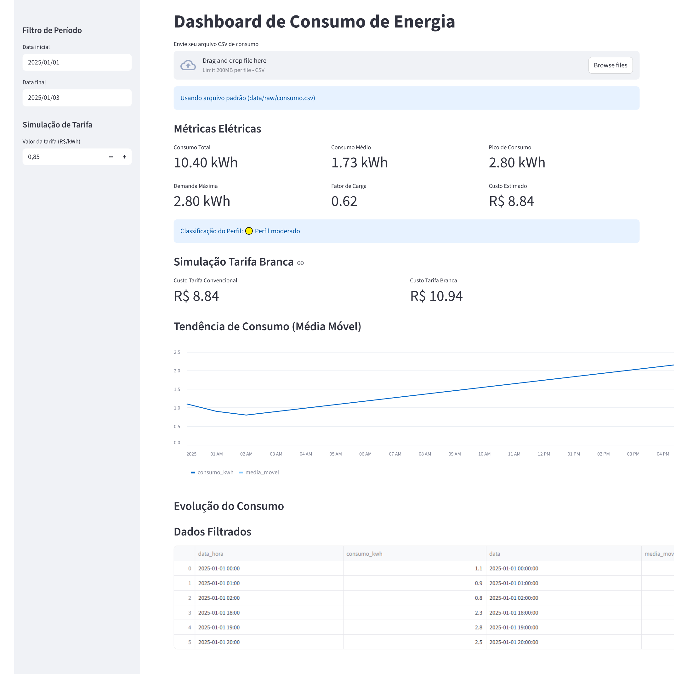

# Análise de Consumo de Energia Elétrica

Projeto em Python com Streamlit para análise de consumo energético, simulação tarifária e curva de carga.


## Objetivo

Analisar o consumo de energia elétrica a partir de dados históricos, aplicando conceitos de Engenharia Elétrica como:

- Fator de carga
- Demanda máxima
- Curva de carga
- Simulação de tarifa branca


##  Funcionalidades

- Dashboard interativo com Streamlit
- Análise de consumo energético
- Cálculo de métricas elétricas
- Simulação de tarifa branca
- Identificação de horário de pico
- Curva de carga horária
- Análise de economia energética

---

## Interface do Projeto

### Dashboard Principal



## Tecnologias

- Python
- Streamlit
- Pandas
- Matplotlib

---

## Como executar

```bash
pip install -r requirements.txt
streamlit run main.py